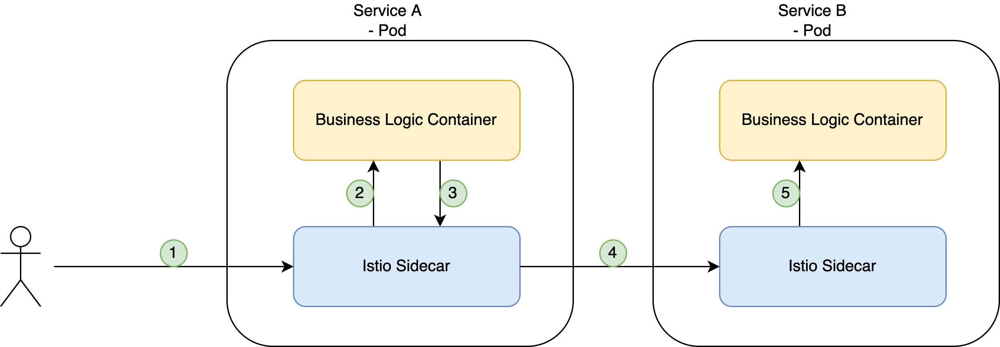

theme: Poster
footer: © Sebastian Neb
slidenumbers: true
autoscale: true

## What a Mesh - Service Mess done wrong

---

### What is a service mesh?

---

> A service mesh is a dedicated infrastructure layer that you can add to your applications
-- Istio

---

> A service mesh is a dedicated infrastructure layer for facilitating service-to-service communications between services or microservices, using a proxy.
-- Wikipedia

---

- Something at the infrastructure layer
- Something with service-to-service communication and microservices

---

### Why do we need it?

---

### 0815 Cloud Architecture (high level, no details)

---

---
[.text: #000000]
[.header: #000000]

### 0815 Cloud Architecture (high level, no details)

- API GW
- Different microservices
- Communication between microservices
- Database access
- External System access

---

### "Customer" requirements

- Encryption everywhere (at rest, in flight)
- End User Authentication
- Network controls (least access)
- Compliance requirements (Tracing / Audit / Access Logs)
- Technical Requirement:
  - Routing to different services

---

There are seperate tool for every of these mentioned requirements

---

#### Encryption everywhere (at rest, in flight)

- cert-manager
- nginx
- self-signed certs
- "Cloud" managed certs
- ...

---

#### End User Authentication

- oathkeeper
- Langauage specific checks (e.g. SpringBoot Security)
- Integrated in Api-Gw
- ...

---

And so on...

---

BUT: Every service has to manage these things on their own.

---

You have to maintain the libraries / frameworks / sidecars you write yourself.

---

> A service mesh is a dedicated infrastructure layer that you can add to your applications
-- Istio

---

> It allows you to transparently add capabilities like observability, traffic management, and security, without adding them to your own code
-- Istio

---

Solution: We use a service mesh and get everything for free?

---

### How does it work?

---

Pre-requisites for this talk and all following information: We are in a *Kubernetes cluster*

^ Service Meshes can also span across clusters or can be hosted completely seperate from clusters, but I'll focus on Kubernetes here.

---

^ Every *Pod* will get a Sidecar Proxy + initContainer.
^ Rewrite of all network configuration

---

Now we have a Sidecar, how do we configure all traffic management functions now?

---

Control Plane

---

Central component that is aware of all services in the mesh and all related configuration.

---

What did we gain?

---

- mTLS between services
- Traffic management (Control routing to services)
- HTTP Logs
- Access controls (which service can talk to which service)
- Tracing
- Easier development

---

#### Additional nice features

- Fault injection
- Circuit breaking
- Canary Deployment
- A/B Deployments
- Metrics

---

Looks easy, it just workz?

---

### Service Mesh "Providers"

- Istio
- LinkerD
- Consul Connect
- AWS App Mesh
- Google Anthos Service Mesh

---

Focus on the "main player"

*Istio*

---

Let's look at the cluster...

Steps done for setup and for you to tryout yourselves available in my GitHub.

---

### Functionalities we actually use from istio

---

- Certificate Management
- Traffic Management
- mTLS Encryption
- JWT Validation
- API Gateway / Routing
- Circuit Breaking / Load Balancing configuration / Timeouts
- (HTTP-) Metrics

---

### Wrap-Up

---

Can make service development easier --> extract shared functionality out of the service

---

Resource consumption increases

---

Installation / Updates is messy, it never "just workz"

---

Istio documentation is still crappy

---

Do you really need a service mesh?

---

## Outlook

---

### Proxyless Service Mesh

- (Istio) Ambient Mesh
- Cilium

---

Thanks <3

[https://github.com/schostin/devcon2022-service-mesh](https://github.com/schostin/devcon2022-service-mesh)

---

# Backup

---

## Projektüberblick & Architektur

--

Wie sieht so eine ganz grundlegende Architektur aus?

---

---

---

## Warum Service Mesh?

---

Warum Service Mesh?

Was sind grundsätzliche Anforderungen des Kunden?

---

- Verschlüsselung überall (at rest, in flight) --> HTTPS minimum
- Authentifizierung des Nutzers (JWT-basiert)
- Network controls
- Compliance Anforderungen (Tracing / Audit / Acccess Logs)
- Technische Anforderung: API-Gateway

## The Good

---

Ein Service Mesh kapselt meist all diese Anforderungen mit mehr Kontrolle und "Einfacher"

Anstatt 6 Tools zu warten und genehmigt zu bekommen --> meistens nur 1 tool notwending (bspw. Istio)

---

Was nutzen wir wirklich?

---

---
<!--  -->

- Certificate Management
- Traffic Management
- mTLS Verschlüsselung
- JWT Validation
- API Gateway / Routing information
- Circuit Breaking / Load Balancing configuration / Timeouts
- (HTTP-) Metriken

^ Darf ich den service aufrufen? Darf der service mich aufrufen?

---

Was nutzen wir darüber hinaus?

---

- Header extraction
- Tracing
- Entitlement-checks (custom Filter)

---

Was sind sonstige Vorteile?

---

- Lokale Entwicklung (mein Service spricht reines HTTP)
- Nutzung von Plattformfunktionalitäten
- Service muss nichts zusätzlich validieren / alles über HTTP Standards
- Service muss nichts von JWT wissen
- Monitoring wird "einfacher"

---

## The Bad

---

Was sind die größten Nachteile?

---

- Komplexität beim Debugging im Cluster
- Jegliche Service Meshs sind schwer zu verstehen
- Eine Konfiguration kann das gesamte Mesh zerstören (wenn falsch angewendet)
- Service-to-Service Kommunikation (was mache ich überhaupt fachlich wenn der service nicht erreichbar ist?)
- Höherer Resourcenverbrauch
- Network-Controls nur wenn auch der Sidecar läuft

^ Warum ist mein service nicht erreichbar? Viel Magie bei der automatic sidecar injection

---

Entwicklersicht: Installation / Update / Configuration ist die Hölle (zumindest mit Istio)

---

## Istio

---

- Konnte alle Anforderungen abdecken mit einem Tool
- Marketing Folien sagen es funktioniert einfach
- Google Driven

---

Es gab nie eine Evaluation, es wurde sich einfach direkt dafür entschieden

Alternativen: Linkerd, Consul Connect, Kuma, AWS App Mesh

---

## Wrap-Up

---

- Service Meshes bieten große Vorteile, speziell wenn man service-to-service Kommunikation hat.
- Resourcenverbrauch in unserem Umfeld vernachlässigbar (wenn man schon einen SpringBoot Microservice hat, macht ein zusätzlicher envoy keinen Unterschied)
- Es muss bitte nicht immer Istio sein, leichtgewichtiger geht auch

---

Danke für Eure Aufmerksamkeit

[https://www.linkedin.com/in/sebastian-neb/](https://www.linkedin.com/in/sebastian-neb/)
[https://github.com/schostin](https://github.com/schostin)

---

