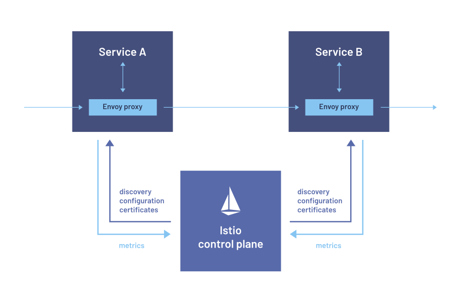

theme: Poster
footer: © Sebastian Neb
slidenumbers: true

# Service Mesh

---

Disclaimer: Die Folien sind in circa 30 Minuten Arbeit entstanden. Fragt gerne jederzeit wenn Ihr Fragen habt oder etwas unklar ist / fehlt. Denglisch ftw.

---

## Wer bin ich?

Sebastian Neb, 28 Jahre, Lead Developer bei Senacor.

Master of Science, Informatik, Uni Bonn

Cloud, Backend & DevOps

---

## Projektüberblick & Architektur

---

> Wir wollen mit unserem Online Banking in die Cloud gehen
-- Eine Bank

---

Wie sieht so eine ganz grundlegende Architektur aus?

---

Todo: Insert Architekturbild

---

---

## Warum Service Mesh?

---

Warum Service Mesh?

Was sind grundsätzliche Anforderungen des Kunden?

---

- Verschlüsselung überall (at rest, in flight) --> HTTPS minimum
- Authentifizierung des Nutzers (JWT-basiert)
- Network controls
- Compliance Anforderungen (Tracing / Audit / Acccess Logs)
- Technische Anforderung: API-Gateway

---

Es gibt für jedes dieser Punkte einzelne / eigene Tools

---

Verschlüsselung überall (at rest, in flight) --> HTTPS minimum

cert-manager / nginx / self-signed certs

---

Authentifizierung des Nutzers (JWT-basiert)

oathkeeper proxy

---

network controls

calico (TCP)

---

Technische Anforderung: API-Gateway

Kubernetes ingress / ambassador / nginx

---

## The Good

---

Ein Service Mesh kapselt meist all diese Anforderungen mit mehr Kontrolle und "Einfacher"

Anstatt 6 Tools zu warten und genehmigt zu bekommen --> meistens nur 1 tool notwending (bspw. Istio)

---

---

Was ist daran "schön"?

---

<!--  -->

- Jeder service bekommt diesen Sidecar "automagisch".
- Funktionalitäten die sonst jeder service haben musste werden in die Plattform ausgelagert
- Automatisches Zertifikats-Management und "automatische" Network-Controls

---

Was nutzen wir wirklich?

---

---
<!--  -->

- Certificate Management
- Traffic Management
- mTLS Verschlüsselung
- JWT Validation
- API Gateway / Routing information
- Circuit Breaking / Load Balancing configuration / Timeouts
- (HTTP-) Metriken

^ Darf ich den service aufrufen? Darf der service mich aufrufen?

---

Was nutzen wir darüber hinaus?

---

- Header extraction
- Tracing
- Entitlement-checks (custom Filter)

---

Was sind sonstige Vorteile?

---

- Lokale Entwicklung (mein Service spricht reines HTTP)
- Nutzung von Plattformfunktionalitäten
- Service muss nichts zusätzlich validieren / alles über HTTP Standards
- Service muss nichts von JWT wissen
- Monitoring wird "einfacher"

---

## The Bad

---

Was sind die größten Nachteile?

---

- Komplexität beim Debugging im Cluster
- Jegliche Service Meshs sind schwer zu verstehen
- Eine Konfiguration kann das gesamte Mesh zerstören (wenn falsch angewendet)
- Service-to-Service Kommunikation (was mache ich überhaupt fachlich wenn der service nicht erreichbar ist?)
- Höherer Resourcenverbrauch
- Network-Controls nur wenn auch der Sidecar läuft

^ Warum ist mein service nicht erreichbar? Viel Magie bei der automatic sidecar injection

---

Entwicklersicht: Installation / Update / Configuration ist die Hölle (zumindest mit Istio)

---

## Istio

---

- Konnte alle Anforderungen abdecken mit einem Tool
- Marketing Folien sagen es funktioniert einfach
- Google Driven

---

Es gab nie eine Evaluation, es wurde sich einfach direkt dafür entschieden

Alternativen: Linkerd, Consul Connect, Kuma, AWS App Mesh

---

## Wrap-Up

---

- Service Meshes bieten große Vorteile, speziell wenn man service-to-service Kommunikation hat.
- Resourcenverbrauch in unserem Umfeld vernachlässigbar (wenn man schon einen SpringBoot Microservice hat, macht ein zusätzlicher envoy keinen Unterschied)
- Es muss bitte nicht immer Istio sein, leichtgewichtiger geht auch

---

## Fragen?

---

Danke für Eure Aufmerksamkeit

[https://www.linkedin.com/in/sebastian-neb/](https://www.linkedin.com/in/sebastian-neb/)
[https://github.com/schostin](https://github.com/schostin)
